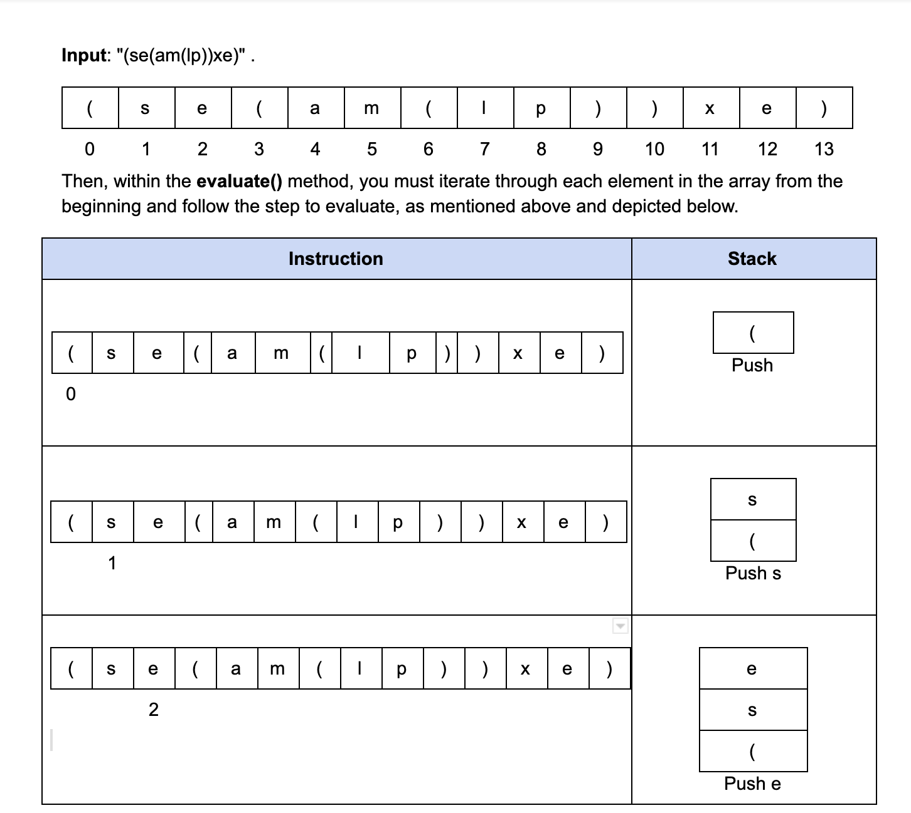
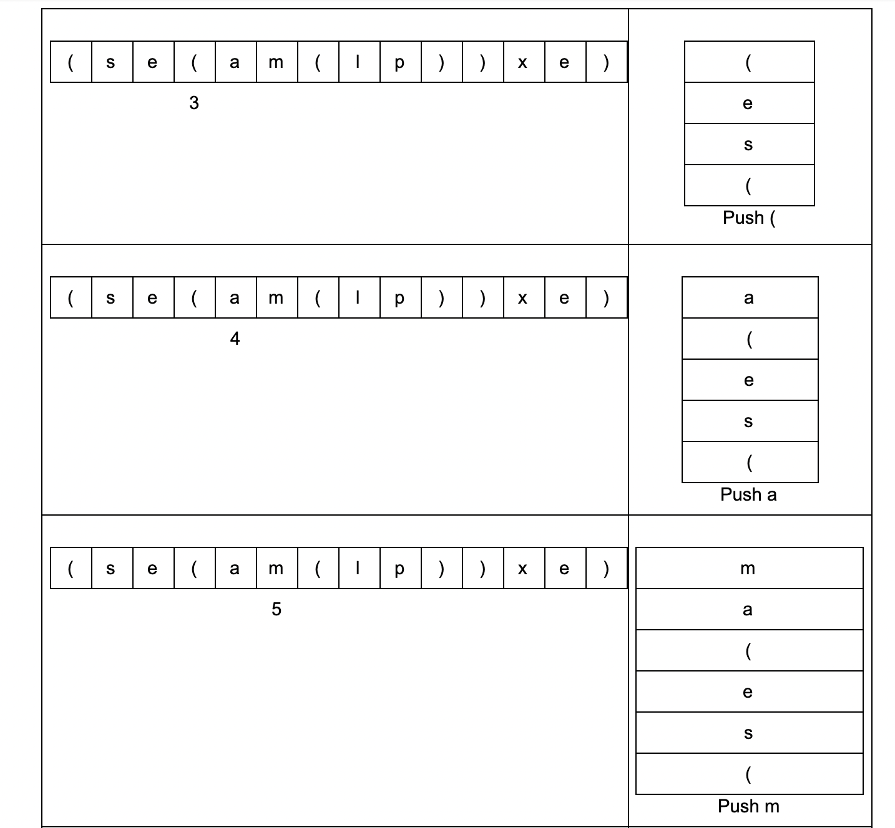
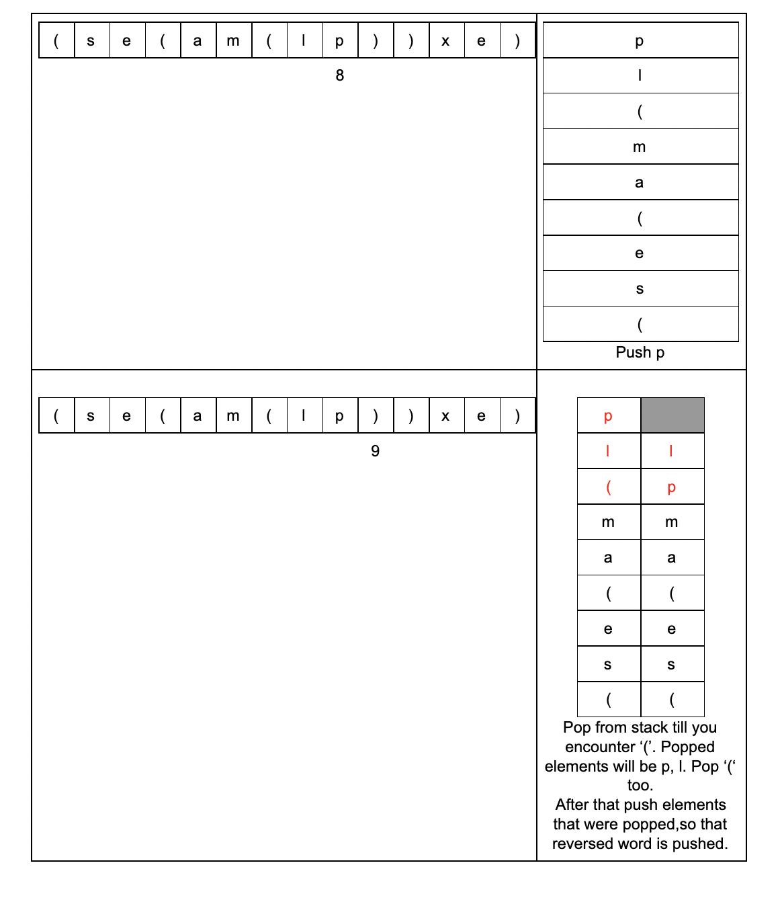
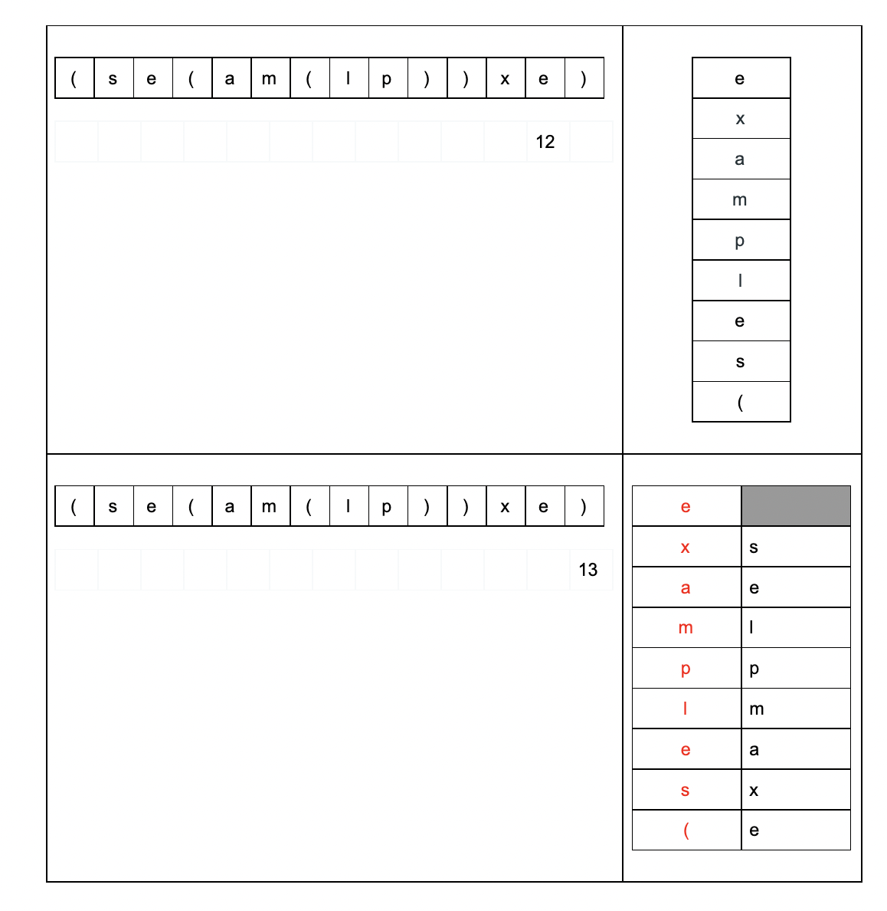
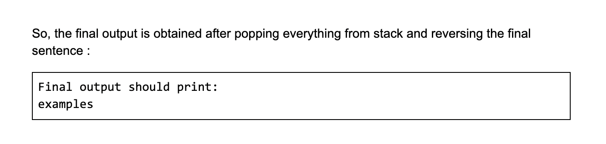
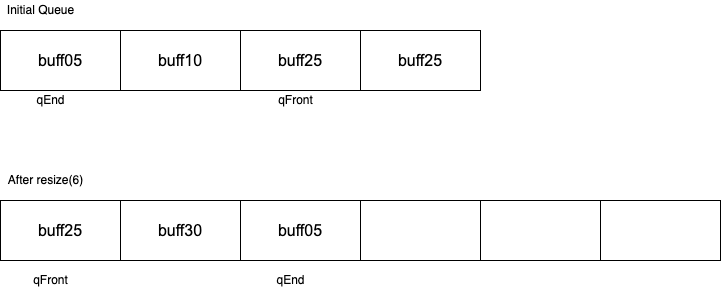

# CSCI 2270 – Data Structures - Assignment 5 - Stacks and Queues

## Objectives

1. Create, add to, delete from, and work with a stack implemented as a linked list
2. Create, add to, delete from, and work with a queue implemented as an array

## Instructions

Write code to complete Parts 1 and 2. Implement the solution for each part as a separate program. To receive credit for your code, you will need to pass the necessary test cases. Use the following steps to test your code as you work on the assignment:

 1. Open up your Linux terminal, navigate to the build directory of this assignment (e.g. `cd build`).
 2. Run the `cmake ..` command.
 3. Run the `make` command.
 4. If there are no compilation errors, three executables will be generated within the build directory: `run_app_1`, `run_app_2`, and `run_tests`.
 5. If you would like to run your program including your app implementation in the `main` function, execute `run_app_1` from the terminal by typing `./run_app_1`. Similarly, you can execute `run_app_2`.
 6. While executing the `run_app_2` you need to pass the initial queue size using command line, so the command to execute is `./run_app_2 <queue_size>`. 
 6. To run the grading tests, execute `run_tests` from the terminal by typing `./run_tests`. 


## Overview

Stacks and Queues are both data structures that can be implemented using either an array or a linked list. You will gain practice with each of these in the following two programs.   
The first is to build a word decoder using a linked list stack.  
The second is to simulate a course registration waitlist system using a circular array based queue.

## Part 1 - Word decoder
### To-Dos
- [ ] Implement the `WordDecoder` method
- [ ] Implement the `isEmpty` method
- [ ] Implement the `push` method
- [ ] Implement the `pop` method
- [ ] Implement the `peek` method
- [ ] Implement the `getStackHead` method
- [ ] Implement the `evaluate` method
- [ ] Implement the `~WordDecoder` method
- [ ] Complete the `main_1` function with input prompting


### Background

Sherlock and Watson are working on a new case. Suddenly, Sherlock gets an encoded text from Moriarity. He figures out that he needs to reverse all the strings enclosed by parenthesis to get a meaningful word. He needs help from you to do this. We know that stacks are great for reversing strings and parsing nested structures. 

Your task will be to implement the stack using a linked list and an accompanying driver file to test your implementation.

### How to Evaluate
The input will be nested sentences which are separated by closing and opening square brackets. We will evaluate sentences by pushing each word onto a stack until we encounter a `“)”` bracket. After we get a `“)”` bracket we subsequently pop from the stack until we get the first `“(“`. After this we again, push the letters the were popped in reverse order.

It is guaranteed that every `“(“` is matched with a `“)”` bracket. 
You may think of the provided sentence as a nested representation. The idea will be to start at the deepest nested level and process them first. For sentences on the same level, you should start by processing from bottom to top.

### Example








### Class Specifications

The node structure for the linked list is defined in `WordDecoder.hpp`. We have a struct Letter as they represent letters in a word.

```cpp
struct Letter
{
    string Letter; // the string to store
    Letter* next; // the pointer to the next node
};

```

The **WordDecoder** class definition is provided in the file `WordDecoder.hpp` in Canvas. *`//Do not modify this file or your code won’t work!`* 

### Instructions for the file `WordDecoder.cpp`

Fill in the file `WordDecoder.cpp` according to the following specifications.

**Letter\* stackHead;**
+ Points to the top of the stack

**Letter\* getStackHead()** { return stackHead; }
+ Returns the stackHead.  **This is already implemented.**

#### 1. `WordDecoder();`
+ Class constructor; set the `stackHead` pointer to NULL

#### 2. `bool isEmpty();`
+ Returns true if the stack is empty

#### 3. `void push(string letter);`
+ Push a letter to the stack

#### 4. `void pop();`
+ Pop the element out of the stack. Do not leave any memory leak. Print `Stack empty, cannot pop a letter.` if the stack is empty.

#### 5. `Letter\* peek();`
+ Returns the top of the stack. Print `Stack empty, cannot peek.` if the stack is empty.
 
#### 6. `void evaluate(std::string\* s, int size);`
+ This function will accept an array of strings and the length of the array. This function will evaluate the encoded word and print the final decoded word after performing the stack operations described above. E.g.
```shell
  The decoded word: zyx
```
#### 7. `~WordDecoder();`
+ Destroy the stack. Take special care not to leave any memory leaks

### Instructions for the `main_1.cpp` file

+ The driver code should start with printing `Enter the encoded word separated by '(' and ')'.`
+ Print `#> `. Then accept the encoded string from user.
+ If the string array is empty print `Nothing to evaluate`
+ Otherwise call the evaluate function with the string array.
+ Free any unused memory

<!-- ### Order of function implementation

1. Constructor
2. isEmpty
3. push
4. pop
5. peek
6. evaluate
7. Destructor
8. main -->

### Example Runs:
1.
```shell
Enter the encoded word separated by '(' and ')'.
#> (xyz)
The decoded word: zyx
```

2.
```shell
Enter the encoded word separated by '(' and ')'.
#> ((od)og)
The decoded word: good
```

3.
```shell
Enter the encoded word separated by '(' and ')'.
#> (ni(su(ats)))
The decoded word: sustain
```

## Part 2 - WaitlistQueue Class
### To-Dos
- [ ] Implement the `size` method
- [ ] Implement the `capacity` method
- [ ] Implement the `isEmpty` method
- [ ] Implement the `isFull` method
- [ ] Implement the `enqueue` method
- [ ] Implement the `dequeue` method
- [ ] Implement the `peek` method
- [ ] Implement the `resize` method
- [ ] Complete the `main_2` function with an interactive menu

>NOTE: Beware of edge cases that arise from the array being circular.

### Background
In this class, you will build a queue using the circular array implementation to emulate a simple course registration waitlist. Implement the methods of `WaitlistQueue` according to the following specifications.  

You will have to complete the TODOs in both the class implementation in `WaitlistQueue.cpp` and 
the driver file `main_2.cpp`. Do not modify the header file! 

The **WaitlistQueue** class definition is provided in the file `WaitlistQueue.hpp`. Do 
not modify this file! We have already implemented the following properties and methods:

- `string queue`  A dynamically allocated array of strings to act as a container for the circular queue.

- `int qCapacity` The total capacity of the dynamically allocated array, queue. This value will be passed in a parameterized constructor as an argument.

- `int qFront` Index in the array that keeps track of the index at which dequeue will happen next, i.e., it refers to the front (or first) element in the queue.

- `int qEnd` Index in the array that keeps track of the tail element in the queue.

- `WaitlistQueue(int qSize=5)` Constructor. Initialized `qFront, qEnd to -1` and `qCapacity to qSize`. It's already implemented for you, `// DO NOT MODIFY THIS`.

### Instructions
You must complete the implementations of the following methods in `WaitlistQueue.cpp`. Please follow the order given here.

#### 1. `int size()`
+ Return the number of active elements in the queue. Not to be confused with `qCapacity`.

#### 2. `int capacity()`
+ Return the capacity of the queue container, i.e., `qCapacity`.

#### 3. `bool isEmpty()`
+ Return true if the queue is empty, false otherwise

#### 4. `bool isFull()`
+ Return true if the queue is full, false otherwise

#### 5. `void enqueue(string value)`
+ If the queue is not full, then add the value to the end of the queue and modify `qFront` and/or `qEnd` appropriately, else `print "Waitlist is full. Cannot enqueue."`

#### 6. `void dequeue()`
+ Remove the first element from the queue if the queue is not empty and modify `qFront` and/or `qEnd` appropriately. Otherwise, `print "Waitlist is empty. Cannot dequeue."`
+ Take care of the edge case where there is only 1 element in the queue to be dequeued. In such a case, you should appropriately reset `qFront` and `qEnd`.

#### 7. `string peek()`
+ If the queue is empty then return `<EMPTY QUEUE>`. Otherwise, return the first element in the queue.

#### 8. `void resize(int newSize)`
+ Resize the queue container to this newSize (>= 1). You must start at the `front` of the original queue and copy elements till the `end` of the original queue, or until the new queue is full. 
+ You must update queue, `qFront`, `qEnd` and `qCapacity` appropriately. Take care of any possible memory leaks.

#### Example



#### 9. `~WaitlistQueue()`
+ Destructor. Deallocate the memory for the `queue` container.


### Instructions for the `main_2.cpp` file

Your program will start by creating a queue, pass the size of the queue as the first argument from command line and then display a menu by calling the `menu()` function which is included in the provided skeleton code.   
The user will select an option from the menu to decide upon what the program will do, after which the menu will be displayed again. Below are the specifics of the menu 
If user selects options other than 1 to 5, print the following statement
```cpp
cout << "Invalid choice. Please enter a number between 1 and 5." << endl;
```
>Tips: We recommend using the stream extraction operator`(>>)` rather than the `getline()` method to get input.*

*Option 1: Enqueue*

+ Request the user for the value to be enqueued using the below print statement 
```cpp
cout << "Enter the value to add into queue:" << endl;
```
+ Call the `enqueue()` method on the value given by user.
 
*Option 2: Dequeue* 

+ Simply call the `dequeue()` method.

*Option 3: Peek*

+ Simply print the output of the `peek()` method.

*Option 4: Resize*
+ Request the user for the new size of the queue using the below print statement
```cpp
cout << "Enter the new capacity:" << endl;
```
+ Call the `resize()` function after printing the following message
`"Resizing from <old_capacity> to <new_capacity>"`

*Option 5: Quit*
+ Print the following message
```cpp
cout << "Quitting..." << endl;
```
+ Prior to exiting the program, print the queue from front to back.  
Example:
```shell
Contents of the queue:
buff01
buff02
buff03
```
+ Print `"Goodbye!"` and exit the program.


#### Below is a sample output

```shell
*----------------------------------------*
Choose an option:
1. Enqueue
2. Dequeue
3. Peek
4. Resize
5. Quit
*----------------------------------------*
1
Enter the value to add into queue:course1
*----------------------------------------*
Choose an option:
1. Enqueue
2. Dequeue
3. Peek
4. Resize
5. Quit
*----------------------------------------*
1
Enter the value to add into queue:course2
*----------------------------------------*
Choose an option:
1. Enqueue
2. Dequeue
3. Peek
4. Resize
5. Quit
*----------------------------------------*
1
Enter the value to add into queue:course3
*----------------------------------------*
Choose an option:
1. Enqueue
2. Dequeue
3. Peek
4. Resize
5. Quit
*----------------------------------------*
2
*----------------------------------------*
Choose an option:
1. Enqueue
2. Dequeue
3. Peek
4. Resize
5. Quit
*----------------------------------------*
3
course3
*----------------------------------------*
Choose an option:
1. Enqueue
2. Dequeue
3. Peek
4. Resize
5. Quit
*----------------------------------------*
5
Quitting...
Contents of the queue:
course2
course3
Goodbye!
```


<!-- ### Order of function implementation

1. Constructor
2. size
3. capacity
4. isEmpty
5. isFull 
5. enqueue
6. dequeue
7. peek
8. resize
8. main -->

## Submitting your code:
Write your code and push the changes to your private repository. Log onto Canvas and go to `Assignment 5`. Paste your GitHub repository link and submit.